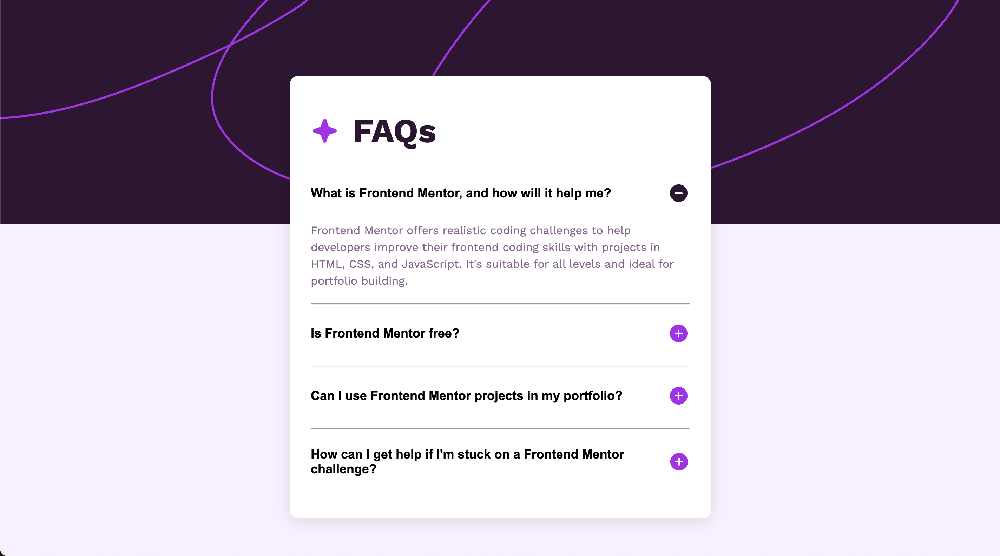

# Frontend Mentor - FAQ Accordion Solution

This is a solution to the [FAQ accordion challenge on Frontend Mentor](https://www.frontendmentor.io/challenges/faq-accordion-wyfFdeBwBz).

## Table of contents

- [Frontend Mentor - FAQ Accordion Solution](#frontend-mentor---faq-accordion-solution)
  - [Table of contents](#table-of-contents)
  - [Overview](#overview)
    - [The challenge](#the-challenge)
    - [Screenshot](#screenshot)
    - [Links](#links)
  - [My process](#my-process)
    - [Built with](#built-with)
    - [What I learned](#what-i-learned)
    - [Continued development](#continued-development)
    - [Useful resources](#useful-resources)
  - [Author](#author)
  - [Acknowledgments](#acknowledgments)

## Overview

### The challenge

Users should be able to:

- Hide/Show the answer to a question when the question is clicked
- Navigate the questions and hide/show answers using keyboard navigation alone
- View the optimal layout for the interface depending on their device's screen size
- See hover and focus states for all interactive elements on the page

### Screenshot

### Links

- Solution URL: [My solution](https://github.com/Andy-Fernandez/3-faq-accordion-main)
- Live Site URL: [Site](https://andy-fernandez.github.io/3-faq-accordion-main/)

## My process

### Built with

- Semantic HTML5 markup
- CSS custom properties
- Flexbox
- JavaScript (for interaction, minimal DOM manipulation)

### What I learned

In this project, I learned how to:

- Implement accessible interactive elements with JavaScript, such as toggling the visibility of FAQ answers.
- Enhance user experience by incorporating keyboard navigation and responsive design.
- Use HTML ARIA attributes to improve accessibility and provide meaningful states for interactive elements.

### Continued development

In the future, I plan to:

- Refine the JavaScript code to handle multiple open/close interactions more efficiently.
- Improve accessibility features further by adding ARIA roles and states.
- Optimize the CSS for better performance and adaptability to different screen sizes.

### Useful resources

- [MDN Web Docs on Flexbox](https://developer.mozilla.org/en-US/docs/Web/CSS/CSS_Flexible_Box_Layout/Basic_Concepts_of_Flexbox)
- [MDN Web Docs on ARIA](https://developer.mozilla.org/en-US/docs/Web/Accessibility/ARIA)

## Author

- [Your Name](https://your-portfolio-url.com)

## Acknowledgments

- Thanks to Frontend Mentor for the challenging and educational project.
- Thanks to the community for feedback and suggestions.
